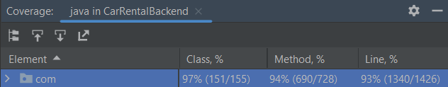
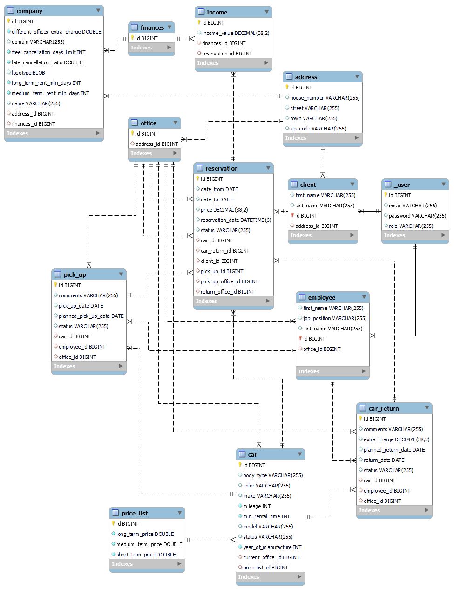

## Car Rental - Backend

Frontend part of the application: https://github.com/Jakub112358/CarRentalFrontend

### Developer:
- Jakub Szymański

### Running application:
Before running application you have to configure your database. Instructions to do so are included in application.yml file.

### General app description:
The main purpose of the application is to solve the problem of managing car rental company that has branch offices in various cities. 
The solution will be to create a personalized web application.

### General technical description: 

**Backend:**
Spring Boot REST application. The application meets all the requirements of level 2 of the Richardson Maturity Model. 
I use tools such as e.g. Lombok or JJWT. I focus on creating clean code and using appropriate design patters.

**Frontend:**
Angular application with PrimeNG library.

### Tech Stack:
**Backend:**
- Java 17
- Spring Boot 3
- Security: Spring Security 6 based on user roles + Json Web Tokens (JWT)
- Testing: Unit and integration tests (singular and parameterized) using tools such as JUnit, MockMVC, Mockito.
- Test coverage:
 

**DataBase:**
- MySQL / H2 for development and testing
- DB structure: autogenerated by Hibernate with usage of relations, fetch types, cascades
- DB queries: 
  - JPARepository default methods,
  - JPA derived queries, 
  - JPA Criteria API,
  - JPQL custom queries

**Frontend:**
- Angular 15

### App features: 

**As Admin:**
- login to the system
- configuring company details
- managing users (full CRUD operations, including assigning roles)
- managing clients (full CRUD operations)
- managing employees (full CRUD operations)
- managing cars (full CRUD operations)
- managing price lists (full CRUD operations)
- managing offices (full CRUD operations)

 **As Client:**
- register an account
- login to the system
- making reservations
  - setting specification of searching car that could include any of following:
     - list of desired makes,
     - list of desired models,
     - maximum mileage
     - minimum year of manufacture
     - list of desired body types
     - list of desired colors,
  - selecting pick-up and return dates 
  - selecting pick-up and return offices,

  - based on the given data application would return the list of available cars with calculated prices(taking into account interfering with other reservations, car specification, place of car pick-up and return)
  - selecting one of the proposals and making reservation that automatically generates company income.
- cancelling reservations
  - cancelling reservation auto-generate company expense 
  - based on the date of cancellation and the date of rental beginning app cashback may be reduced by late-cancelling extra charge

**As Employee**

- login to the system
- reading and updating pick-ups and returns
  - changing pick up/return status
  - charging additional fees
  - adding comments

### Features in-development:
- managing finances: in the current version incomes are auto-generated in moment of making/cancelling a reservation and saving in Data Base, but access to them via API is not implemented yet.
- currency converter: in the current version all prices are set in one currency. Next version will support cunverting currency by using external API provided by Narodowy Bank Polski.

### Version control: 
- system: GIT
- main branches:
  - main – release app version
  - dev – stable and tested version of application

### Data Base Model: 

### API documentation:

#1 Run the application.  
#2 Open in your browser: http://localhost:8080/swagger-ui/index.html

